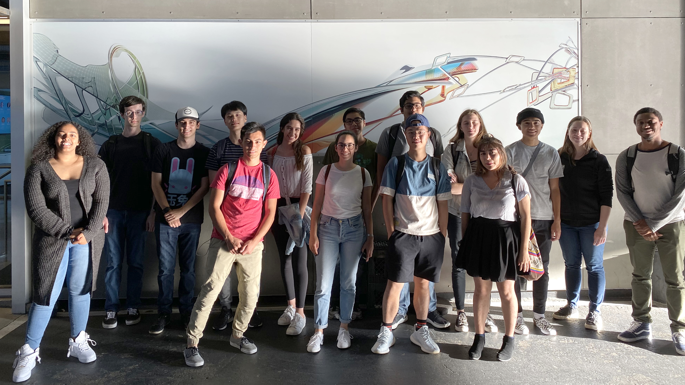
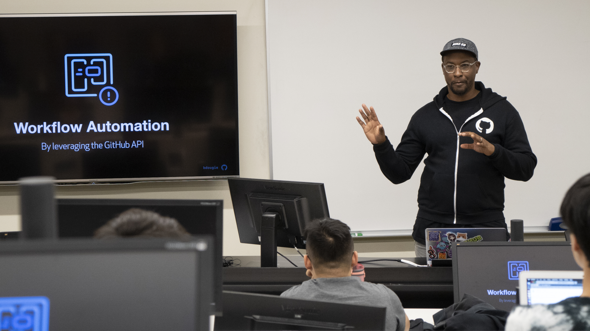

<link rel="stylesheet" href="https://cdn.jsdelivr.net/npm/bulma-carousel@4.0.4/dist/css/bulma-carousel.min.css">

  

    

      

        
      

      

        Scholars at the <a href="https://www.exploratorium.edu/">Exploratorium</a> field trip as part of the <a href="https://scholars.cs.usfca.edu/start2019/">CS Head Start</a> program in 2019.
      

    

  

  

    

      

        
      

      

        Scholars at the <a href="https://www.autodesk.com/technology-centers/san-francisco">AutoDesk Technology Center</a> field trip as part of the <a href="https://scholars.cs.usfca.edu/cs186-fall2019/">Community Engaged CS</a> course in 2019.
      

    

  

  

    

      

        
      

      

        Scholars at the <a href="https://www.lyft.com/careers">Lyft</a> field trip as part of the <a href="https://scholars.cs.usfca.edu/cs186-fall2019/">Community Engaged CS</a> course in 2019.
      

    

  

  

    

      

        
      

      

        <a href="https://twitter.com/bdougieYO">Brian Douglas</a>, Developer Advocate at Github.com, speaking to scholars as part of the <a href="https://scholars.cs.usfca.edu/cs186-fall2019/">Community Engaged CS</a> course in 2019.
      

    

  

  

    

      

        

        <iframe width="560" height="315" src="https://www.youtube.com/embed/wpYx__6KhHk" frameborder="0" allow="accelerometer; autoplay; encrypted-media; gyroscope; picture-in-picture" allowfullscreen class="has-ratio"></iframe>
        

      

      

        Video from Professor Sophie Engle introducting the Computer Engaged Scholars in CS scholarship program.
      

    

  

Welcome to the <strong>Community Engaged Scholars in Computer Science</strong> scholarship program at the University of San Francisco. This program combines scholarships with community-building activities such as field trips to tech companies, guest speakers, faculty and alumni mentoring, social events, and coursework. Scholars receive up to <strong>$4,062.50 in scholarships</strong> per semester plus another $1,000 for conference travel.

<!--
<article class="message is-danger">
  

    <i class="fad fa-calendar-exclamation"></i>
    The priority application deadline for Fall 2020 is <strong>{{ site.data.dates.application_deadline.date | date: "%A %B %d, %Y"}}</strong>. Applications received after that date will be considered for the waiting list. See <a href="/scholarships/apply.html">How to Apply</a> for application details.
  

</article>

<article class="message is-link">
  

    <i class="fad fa-info-circle"></i>
    Questions? Join us for a live Q&A webinar on Mon March 30 or April 6th between 5:00pm and 7:00pm PT. <a href="https://usfca.zoom.us/webinar/register/WN_a2YXki29R864Mz9gZjm49w">Register now!</a>
  

</article>
-->

<h2>Latest Announcements</h2>



<h4 class="title">{{ post.title }}</h4>
<h6 class="subtitle has-text-grey has-text-weight-normal">
  Posted {{ post.date | date: "%A %b %d, %Y" }}
  <a href="{{ post.url }}"><i class="far fa-link"></i></a>
</h6>


{{ post.excerpt }}

<a href="{{ post.url }}">Click to read more...</a>


{{ post.content  }}







<a href="/posts/" class="button is-link">See More &raquo;</a>

